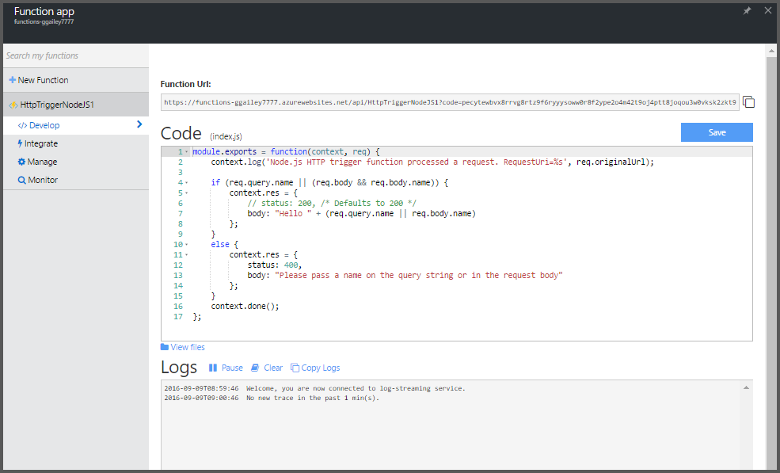
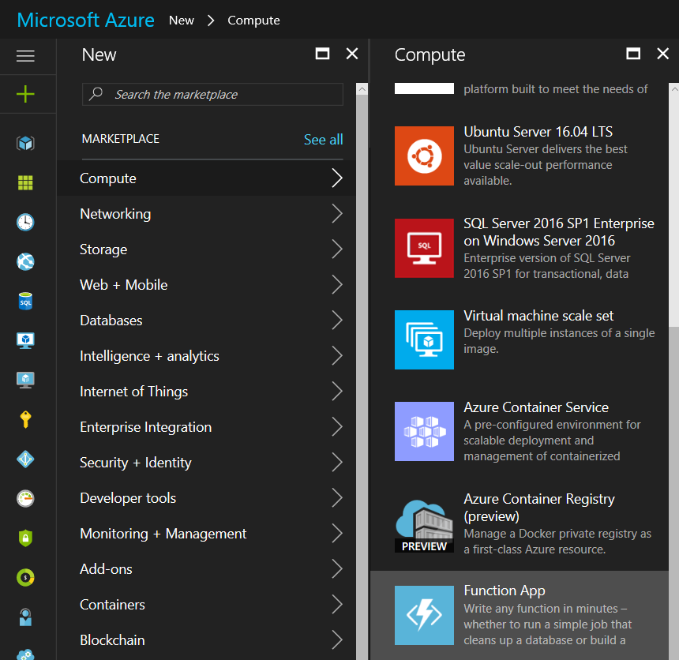
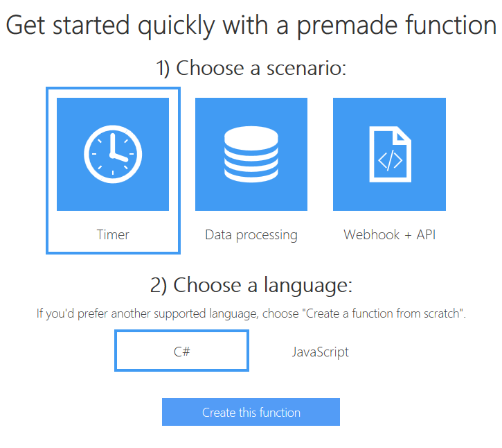
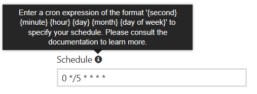
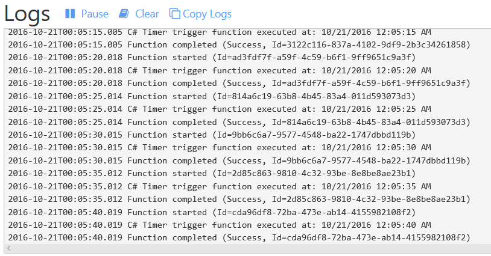
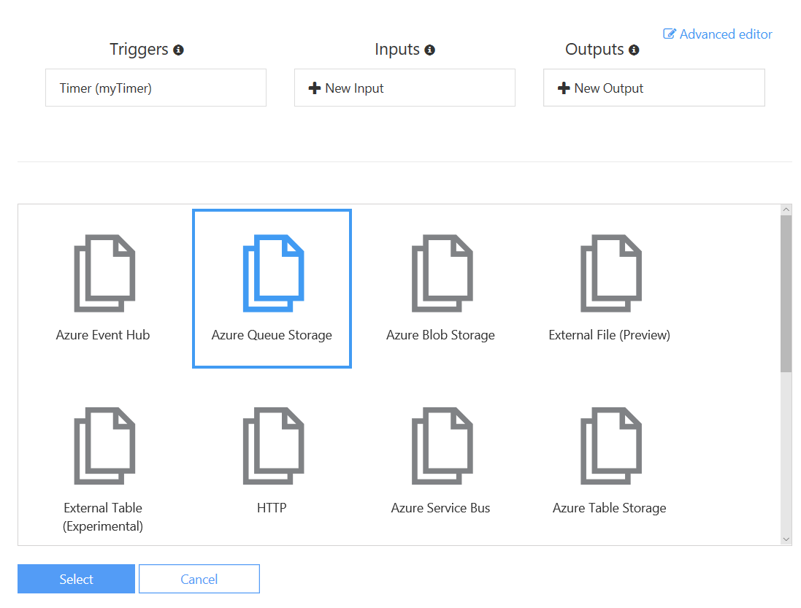
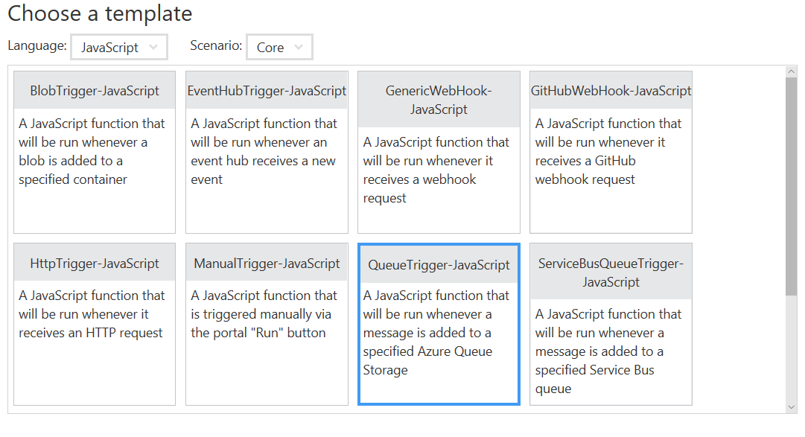
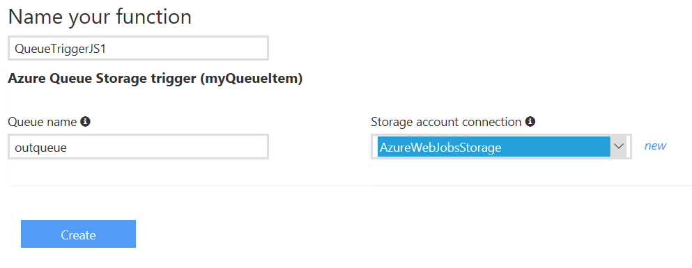

a# MISSION GOAL : Remote Monitoring

Our connectivity to Mars is slowly coming back online, but we have not yet made contact with the crew. In order to automate our communication attempts, we’re going to set up a repeating signal which pings the Mars base at regular intervals.

You’ll use Azure functions to accomplish this task, and ensure that when the crew regains access to their equipment they’re aware of our concerns here on Earth. Let’s get to work. 

____

## MISSION OBJECTIVES

The main objective of this mission is to set up a repeating message which pings the Mars base. You will be working as a part of a team on this objective.

Your next task is to accomplish the following objectives:

1.	Create a function from the quickstart
2.	Test the function
3.	Create a new Timer Based Function in the Azure portal
4.	Add an Azure Storage Queue output
5.	Add a Node Function Which Is Triggered By The Queue


### Objective 1: Create a function from the quickstart

A function app hosts the execution of your functions in Azure. Follow these steps to create a new function app as well as the new function. The new function app is created with a default configuration. For an example of how to explicitly create your function app, see <a href="https://docs.microsoft.com/en-us/azure/azure-functions/functions-create-first-azure-function-azure-portal" target="_blank">the other Azure Functions quickstart tutorial</a>.

Before you can create your first function, you need to have an active Azure account. If you don't already have an Azure account, [free accounts are available](https://azure.microsoft.com/free/).

1. Go to the [Azure Functions portal](https://functions.azure.com/signin) and sign-in with your Azure account.

2. Type a unique **Name** for your new function app or accept the generated one, select your preferred **Region**, then click **Create + get started**. 

3. In the **Quickstart** tab, click **WebHook + API** and **JavaScript**, then click **Create a function**. A new predefined Node.js function is created. 

	

4. (Optional) At this point in the quickstart, you can choose to take a quick tour of Azure Functions features in the portal.	Once you have completed or skipped the tour, you can test your new function by using the HTTP trigger.

### Objective 2: Test the function

Since the Azure Functions quickstarts contain functional code, you can immediately test your new function.

1. In the **Develop** tab, review the **Code** window and notice that this Node.js code expects an HTTP request with a *name* value passed either in the message body or in a query string. When the function runs, this value is returned in the response message.

	

2. Scroll down to the **Request body** text box, change the value of the *name* property to your name, and click **Run**. You will see that execution is triggered by a test HTTP request, information is written to the streaming logs, and the "hello" response is displayed in the **Output**. 

3. To trigger execution of the same function from another browser window or tab, copy the **Function URL** value from the **Develop** tab and paste it in a browser address bar, then append the query string value `&name=yourname` and press enter. The same information is written to the logs and the browser displays the "hello" response as before.

---

### Objective 3: Create a new Timer Based Function in the Azure portal
1. In the Azure portal, create a new Azure Function (New / Virtual Machines / Function App).

	

1. Create a new function using a resource group and dynamic plan.

	

1. The function app should be deployed in a minute or less. Select **Timer** and **C#** and click the **Create this function** button.

	

1. Click on the ##Integrate## tab on the left to view the Timer settings. The default timer schedule is set to run the function once a minute, since the cron expression will match whenever the current second value is equal to zero
 
	

1. Change this *cron expression* value to run every 5 seconds by changing the first value from `0` to `*/5` (as shown below) and clicking the **Save** button.

	

1. Click back to the **Develop** tab and check the **Logs**, which should show that the timer trigger is now executing every 5 seconds.

	

---

### Objective 4: Adding an Azure Storage Queue output

1. Click back to the **Integrate** tab, then click the **New Output** button.

	

1. Select Azure Storage Queue on the list, then click the **Select** button.

	

1. Rename the **Message parameter name** to `output`, change the **Queue name** to `outqueue` if it's not already that, and click the **Save** button (don't click the Go button, which will create a new function).
 
	

> Note: The **Message parameter name** is important, since this will also be the name of the variable in the function code.

1. Click the **Develop** tab and change your function to take an `out stringoutput` parameter and write to this value, as shown below. Click the **Save** button to save your changes.

   ```csharp
   using System;

   public static void Run(TimerInfo myTimer, out string output, TraceWriter log)
   {
       log.Info($"C# Timer trigger function executed at: {DateTime.Now}");    
       output = "Attention Fourth Horizon crew. Please respond and confirm status.";
   }
   ```

---

### Objective 5: Adding a Node Function Which Is Triggered By The Queue

1. Click the **+ New Function** button on the left side. Filter the Language to JavaScript and select `QueueTrigger - Node` from the list.

	

1. Set the **Queue name** to `outqueue`, ensure that the **Storage account connection** is set to `AzureWebJobsStorage`, and click **Create**.

	

1. You'll see that this Function template is already set up to read an item from the queue and log the value:

   ```JavaScript
      module.exports = function (context, myQueueItem) {
       context.log('Node.js queue trigger function processed work item', myQueueItem);
       context.done();
   };
   ```

1. When the function starts up, you should see several entries written to the logs with the message your previous timer based function was writing to the storage queue.

	
